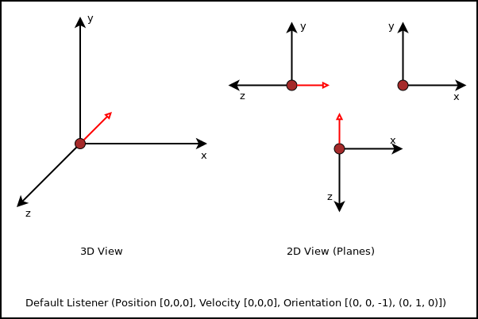
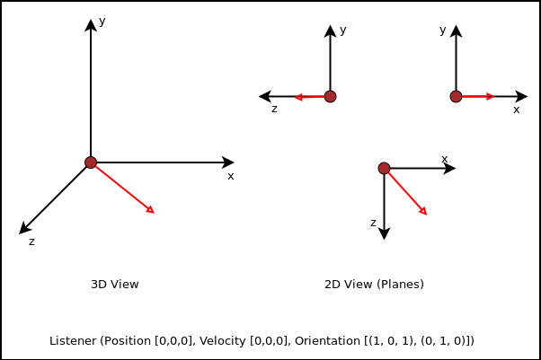

.. module:: pygame2.audio
   :synopsis: Audio in- and output routines.

:mod:`pygame2.audio` - Audio in- and output routines
====================================================

The :mod:`pygame2.audio` module provides easy to use audio in- and output
capabilities based on the OpenAL standard. It is designed to be non-invasive
within a component-based application.

At least three classes need to be used for playing back audio data. The
:class:`SoundSink` handles the audio device connection and controls the overall
playback mechanisms. The :class:`SoundSource` represents an in-application
object that emits sounds and a :class:`SoundData` contains the PCM audio data
to be played.

Device handling
---------------

To actually play back sound or to stream sound to a third-party system (e.g.
a sound server or file), an audio output device needs to be opened. It usually
allows the software to access the audio hardware via the operating system, so
that audio data can be recorded or played back. ::

   >>> sink = SoundSink()        # Open the default audio output device
   >>> sink = SoundSink("oss")   # Open the OSS audio output device
   >>> sink = SoundSink("winmm") # Open the Windows MM audio output device
   ...

.. note::

   Depending on what to accomplish and what kind of quality for audio output to
   have, you might want to use a specific audio output device to be passed as
   argument to the :class:`SoundSink` constructor.

It is possible to create multiple :class:`SoundSink` instances for the same
device. OpenAL specifies an additional device-dependent execution context,
so that multiple contexts (with e.g. different settings) can be used on one
device. Likewise, multiple :class:`SoundSink` objects can use the same device,
while each of them uses its own execution context.

.. note::

   Several OpenAL functions perform context-specific operations. If you mix
   function calls from :mod:`pygame2.openal` with the :mod:`pygame2.audio`
   module, you should ensure that the correct :class:`SoundSink` is activated
   via :meth:`SoundSink.activate()`.

Placing the listener
--------------------

The OpenAL standard supports 3D positional audio, so that a source of sound
can be placed anywhere relative to the listener (the user of the application
or some in-application avatar).

.. image:: images/openalaudio.png

The image above shows a listener surrounded by three sources of
sound. Two are in front of them, while one is behind the listener,
moving from left to right.

OpenAL only knows about a single listener at each time. Each
:class:`SoundSink` can manage its own listener, which represents the user or
in-application avatar. As such, it represents the 'pick-up' point of sounds.

Placing and moving the listener (as well as sound sources in OpenAL) is done
in a RHS coordinate system. That said, the horizontal extent of your monitor
represents the x-axis, the vertical the y-axis and the visual line between
your eyes and the monitor surface reprensents the z-axis.

It is crucial to understand how placing and moving sound sources and the
listener will influence the audio experience. By default, the listener
for each individual :class:`SoundSink` is placed at the center of the
coordinate system, ``(0, 0, 0)``. It does not move and looks along the
z-axis "into" the monitor (most likely the same direction you are
looking at right now).  ::

   >>> listener = SoundListener()
   >>> listener.position = (0, 0, 0)
   >>> listener.velocity = (0, 0, 0)
   >>> listener.orientation = (0, 0, -1, 0, 1, 0)
   ...

While the :attr:`SoundListener.position` and
:attr:`SoundListener.velocity` are quite obvious in their doing, namely
giving the listener a (initial) position and movement,
:attr:`SoundListener.orientation` denotes the direction the listener
"looks at". The orientation consists of two components, the general
direction the listener is headed at and rotation. Both are expressed as
3-value tuples for the x-, y- and z-axis of the coordinate system.

   >>> listener.orientation = (0, 0, -1, 0, 1, 0)
   >>> #                       ^^^^^^^^  ^^^^^^^
   >>> #                       direction rotation

Changing the first 3 values will influence the direction, the listener
looks at.

   >>> listener.orientation = (1, 0, 1, 0, 1, 0)

Changing the last 3 values will influence the rotation of the looking
direction.

.. image:: images/listener_xyz.png

The orientation defines a orthogonal listening direction, so that any sounds
the user (or avatar) hears, are processed correctly. If you imagine a car
driving by on your right side, while you are looking straight ahead (parallel
to the car's driving direction), you will hear the car on your right side
(with your right ear receiving the most noise). If you look on the street,
following the car with your eyes and head, the listening experience will
differ (since both ears of you receive the noise in nearly the same way).

.. note::

   Setting the orientation in OpenAL is somehat similar ot OpenGL's
   ``gluLookAt`` function, which adjusts the view direction. You might want
   to take a look at http://www.glprogramming.com/red/chapter03.html#name2 for
   further details about that.

Creating sound sources
----------------------

A :class:`SoundSource` represents an object that can emit sounds. It can be any
kind of object and allows you to play any sound, you put into it. In an
application you can enable objects to emit sounds, by binding a
:class:`SoundSource` to them.

   >>> source = SoundSource()

.. todo::

   more details

Creating and playing sounds
---------------------------

To create and play sounds you use :class:`SoundData` objects, which contain
the raw PCM data to be played. To play the sound, the :class:`SoundData` needs
to be queued on a :class:`SoundSource`, which provides all the necessary
information about the volume, the position relative to the listener and so
on. ::

   >>> wavsound = load_wav_file("vroom.wav")

There are some helper functions, which create :class:`SoundData` objects from
audio files. If you have a raw PCM data buffer, you can create a
:class:`SoundData` from it directly. ::

   >>> rawsound = SoundData(pcmformat, pcmbuf, size_of_buf, frequency_in_hz)

Queueing the loaded sound is done via the :meth:`SoundSource.queue()` method,
which appends the sound to the source for processing and playback.

   >>> wavsound = load_wav_file("vroom.wav")
   >>> source.queue(wavsound)
   >>> source.request = SOURCE_PLAY

The :class:`SoundSink`, which processes the :class:`SoundSource`, will act
accordingly to the :attr:`SoundSource.request` attribute value.

============= ===================================================
Request Type  Description
============= ===================================================
SOURCE_NONE   Do not perform any specific action with the
              :class:`SoundSource`. Do not change any currently
              active operation on it, too.
SOURCE_PLAY   Process the queued :class:`SoundData` of the
              :class:`SoundSource` and play them.
SOURCE_PAUSE  Pause processing and playback for the
              :class:`SoundSource`.
SOURCE_STOP   Stop processing and playback for the
              :class:`SoundSource`.
SOURCE_REWIND Rewind the queued :class:`SoundData` buffers for the
              :class:`SoundSource`.
============= ===================================================

Audio API
---------

.. data:: SOURCE_NONE

   Indicates that no specific action should be performed on processing the
   :class:`SoundSource`

.. data:: SOURCE_PLAY

   Indicates that the :class:`SoundSource` shall play its :class:`SoundData`.

.. data:: SOURCE_PAUSE

   Indicates that the :class:`SoundSource` shall pause playing.

.. data:: SOURCE_STOP

   Indicates that the :class:`SoundSource` shall stop playing.

.. data:: SOURCE_REWIND

    Indicates that the :class:`SoundSource` shall rewind to the start of the
    currently processed :class:`SoundData` buffer.

.. class:: SoundData([aformat=None[, data=None[, size=None[, frequency=None]]]])

   Buffered audio data.

   .. attribute:: bufid

      The OpenAL buffer id, if any. This will be set automatically by the
      :class:`SoundSink`, if the :class:`SoundData` is processed.

   .. attribute:: format

      The format of the audio data.

   .. attribute:: data

      A buffer containing the raw PCM data to play.

   .. attribute:: size

      The size of the audio buffer.

   .. attribute:: frequency

      The frequency of the audio data.

.. class:: SoundListener([position=(0, 0, 0)[, velocity=(0, 0, 0)[, \
                         orientation=(0, 0, -1, 0, 1, 0)]]])

   Listener position information for the 3D audio environment.

   .. attribute:: position

      The (initial) position of the listener as 3-value tuple within a x-y-z
      coordinate system.

   .. attribute:: velocity

      The velocity of the listener as 3-value tuple within a x-y-z coordinate
      system.

   .. attribute:: orientation

      The forward (in which direction does the listener look) orientation of
      the listener as 6-value tuple within a x-y-z coordinate system. The first
      three values denote the forward vector of the listener, value four to six
      denote the upper orientation vector.

.. class:: SoundSource([gain=1.0[, pitch=1.0[, position=(0, 0, 0)[, \
                       velocity=(0, 0, 0)]]]])

   xxx

   .. attribute:: ssid

      The OpenAL source id, if any. This will be set automatically by the
      :class:`SoundSink`, if the :class:`SoundSource` is processed.

   .. attribute:: gain

      The volume gain of the source.

   .. attribute:: pitch

      The pitch of the source.

   .. attribute:: position

      The (initial) position of the source as 3-value tuple in a x-y-z
      coordinate system.

   .. attribute:: velocity

      The velocity of the source as 3-value tuple in a x-y-z coordinate system.

   .. attribute:: request

      The action to be performed by the :class:`SoundSink`, when it processes
      the :class:`SoundSource`

   .. method:: queue(sounddata : SoundData) -> None

      Adds a :class:`SoundData` audio buffer to the source's processing and
      playback queue.

.. class:: SoundSink(device=None)

   Audio playback system.

   The SoundSink handles audio output for sound sources. It connects to an
   audio output device and manages the source settings, their buffer queues
   and the playback of them.

   .. attribute:: device

      The used OpenAL :class:`pygame2.alc.ALCdevice`.

   .. attribute:: context

      The used :class:`pygame2.alc.ALCcontext`.

   .. method:: activate() -> None

      Activates the :class:`SoundSink`, marking its :attr:`context` as the
      currently active one.

      Subsequent OpenAL operations are done in the context of the
      SoundSink's bindings.

   .. method:: set_listener(listener : SoundListener) -> None

      Sets the listener position for the :class:`SoundSink`.

      .. note::

         This implicitly activates the :class:`SoundSink`.

   .. method:: process_source(source : SoundSource) -> None

      Processes a single :class:`SoundSource`.

      .. note::

        This does *not* activate the :class:`SoundSink`. If another
        :class:`SoundSink` is active, chances are good that the
        source is processed in that :class:`SoundSink`.

   .. method:: process(world, components) -> None

      Processes :class:`SoundSource` components, according to their
      :attr:`SoundSource.request`

      .. note::

         This implicitly activates the :class:`SoundSink`.

.. function:: load_file(fname : string) -> SoundData

   Loads an audio file into a :class:`SoundData` object.

.. function:: load_stream(source : object) -> SoundData

   Not implemented yet.

.. function:: load_wav_file(fname : string) -> SoundData

   Loads a WAV audio file into a :class:`SoundData` object.

.. function:: load_ogg_file(fname : string) -> SoundData

   Loads an Ogg Vorbis audio file into a :class:`SoundData` object.

   .. note::

      This requires the :mod:`pygame2.ogg.voribsfile` module.
